*刚入手树莓派3*
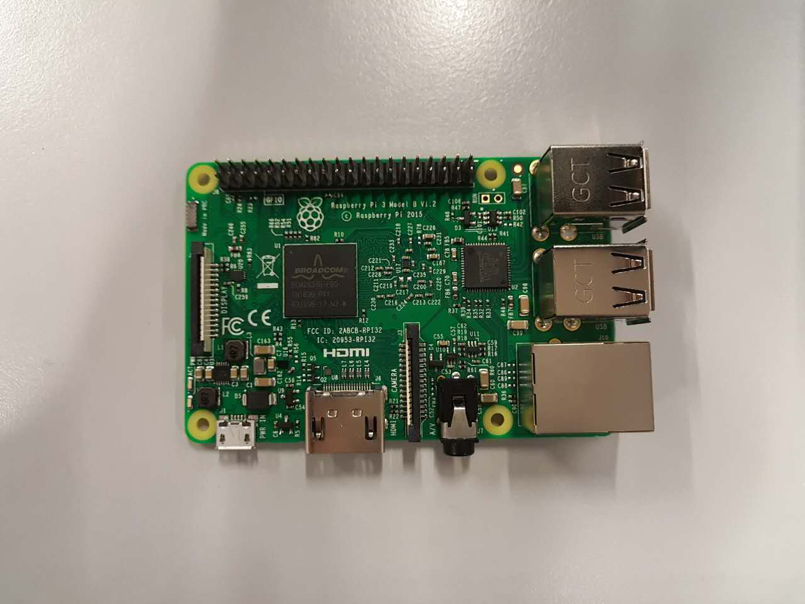

## 准备工作
### 1. 使用win32 disk imager向sd卡写入rapsbian系统
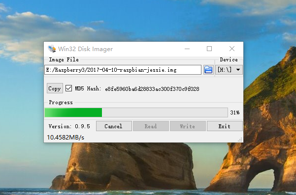

将sd卡插入树莓派
注意是插入背面sd卡槽，不要使用usb转换器连接sd卡。
事实上，我第一次就是使用usb连接sd卡，结果树莓派运行不了，还检查了好久。。。。囧
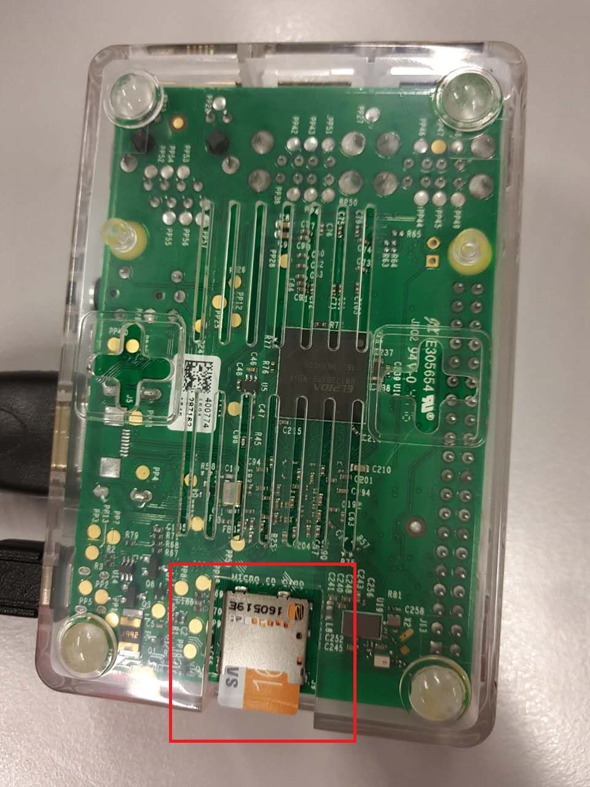
### 2. 连接电脑
第一次连接必须连接显示器或通过网线连接电脑，即有介质连接方式。目的是使树莓派第一次联网
网线连接需要通过命令行来更改设置，而连接显示器可以通过图形界面直接操作树莓派系统，比较直观，推荐连接显示器进行初始设置。
以后可以通过显示器、网线、wifi三种方式

## 树莓派基本设置
插好电源线和hdmi
红灯表示电源连接，黄灯表示系统正在运行
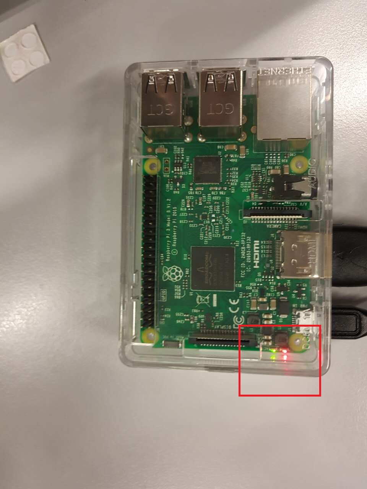

打开显示器，注意一开始可能没有显示，多插拔几次电源重启系统。如果还没有图像，请自行百度解决方案。

本人没有遇到这个问题，所以不列解决方案

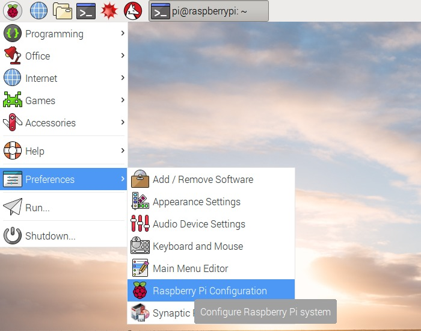
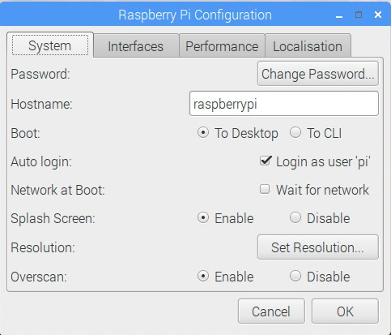

系统设置里点change password修改密码。需要6位以上复杂密码，包括字母。
初始密码 raspberry  默认用户名 pi

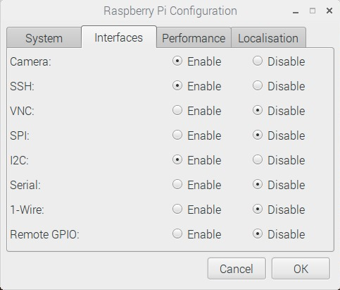

接口设置，打开要使用的服务，建议打开VNC，方便后面使用VNC软件在个人电脑上进行操作

在localisation中检查keyboard， 设置为United States -》 english。

**如果语言设置不正确，有可能在后面的修改网络配置文件时造成整个wifi服务失效**

## wifi连接设置
**目的是开启树莓派后能自动连接之前配置记录好的wifi**

命令行输入：

`sudo su `（进入root模式）

`sudo editor /etc/wpa_supplicant/wpa_supplicant.conf`
打开编辑wifi配置文件，末尾添加以下语句：
```
Network={
	ssid = "wifi-name"
	psk = "password"
}
```
 注意有些特殊网络使用其他加密方式，需要使用其他设置语句，请自行百度

## 远程控制
### a. 网线连接电脑
此方法电脑需要连接到网络。

打开网络共享中心

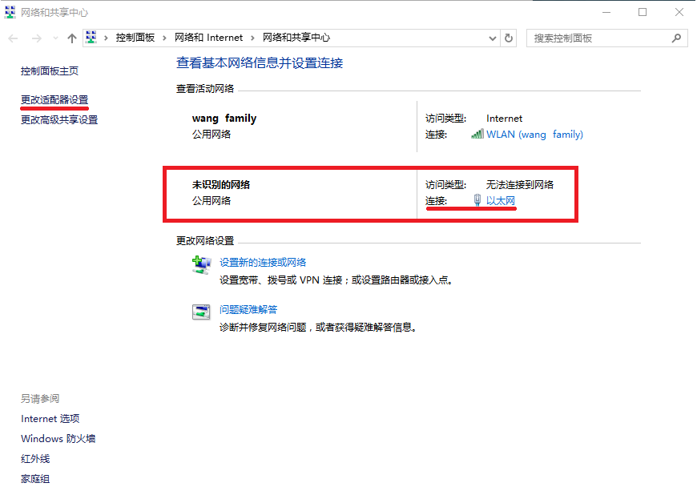

未识别网络即为树莓派网络，点击以太网查看信息

在更改适配器设置中，将连网的wifi共享给树莓派网络连接

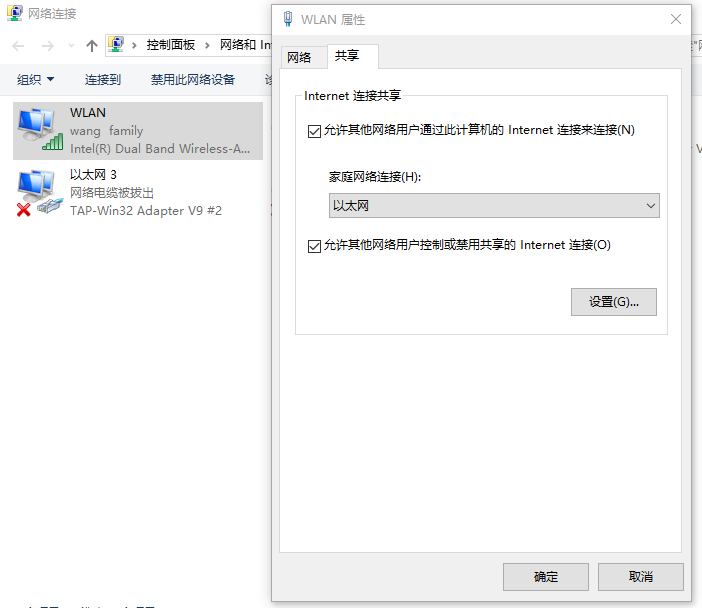

查看树莓派连接的详细信息，记住ipv4地址

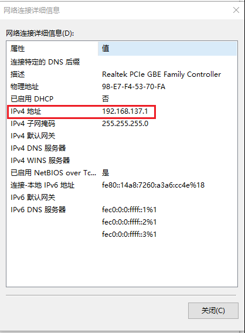

打开cmd，输入 `arp -a`

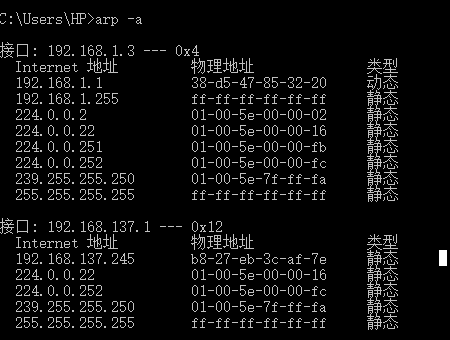

找到刚才记录的ipv4地址字段（192.168.137.x），若找不到树莓派ip（无同字段192.168.137.x），则需要设置静态ip地址。

重新将树莓派sd卡插入电脑，打开文件夹，修改cmdline.txt文件。

在最前端加上ip设置，注意设置同一网段192.168.137.x

修改后sd卡重新插回树莓派。启动，连网完毕后，重新查看接口信息

### b. 使用ssh远程控制
使用ssh工具登录树莓派，默认用户名ip，默认密码raspberry

windows下可以使用putty

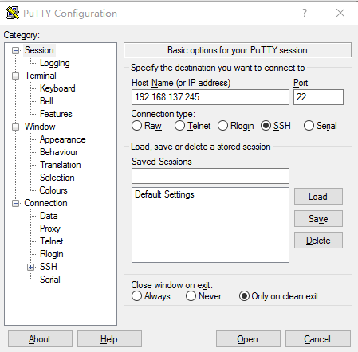
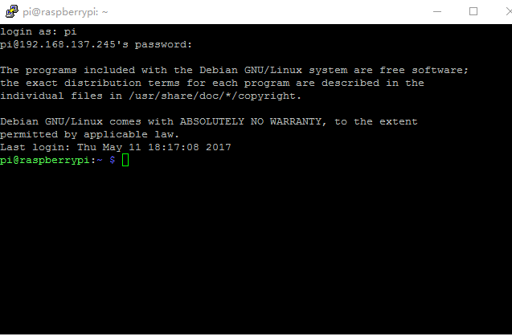

如果是第一次登录树莓派系统，输入 `sudo ifconfig wlan() up` 开启无线网卡

之后类似步骤，修改网络配置文件
```
sudo su
sudo editor /etc/wpa_supplicant/wpa_supplicant.conf
```
### c. 使用windows远程桌面控制树莓派
**准备工作：**
在树莓派中安装服务xrdp。命令行输入：`sudo apt-get install xrdp`。连网后使用ifconfig查看网络信息，并记录树莓派ip地址

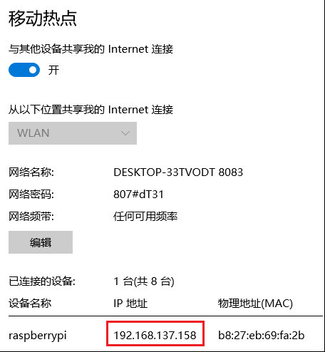

记住ip地址，打开远程桌面

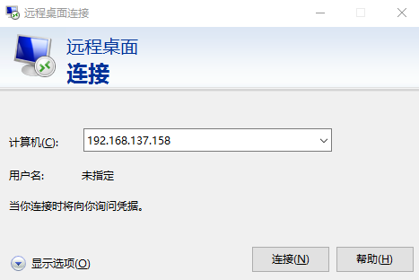
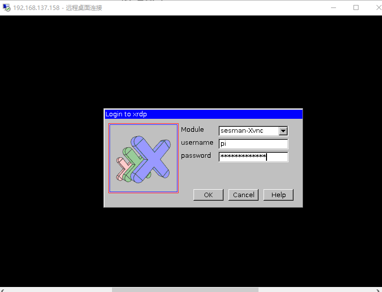

输入密码，连接。

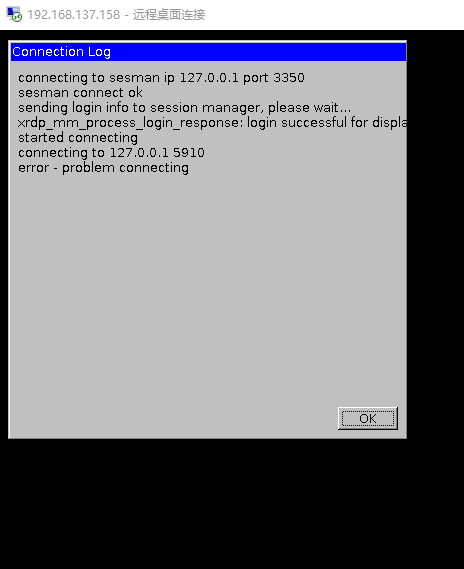

可能出现如图login成功，connecting失败的情况。

**解决方案：** 在树莓派输入`sudo apt-get install tightvncserver`并重启树莓派
远程桌面连接成功


**到此为止，SSH控制，远程桌面控制均已成功。以后有时间再试一下vnc远程控制**
