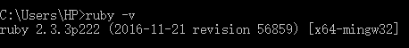
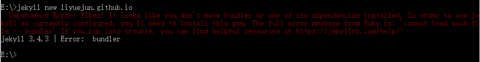
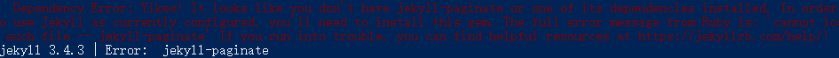
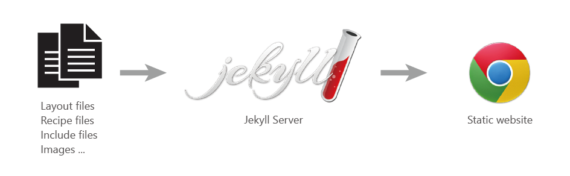
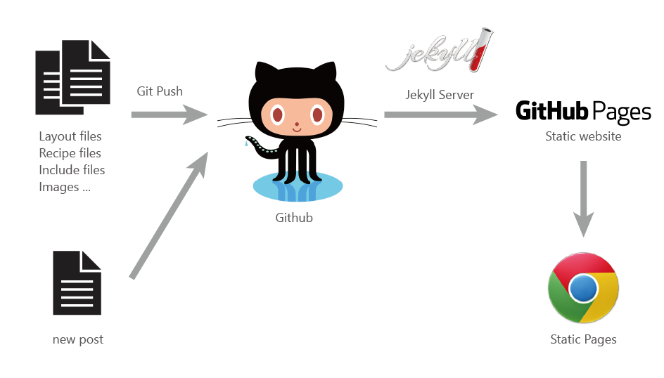

## 对比 Jekyll, Hexo, Hugo等热门解析工具
截止到2017/5/14 ， github上star和folk分别为:

  Jekyll 29.7k/6.61k

  Hugo 17k/2.41k

  Hexo 16.2k/2.49k

考虑到搭建个人博客比较重要的是轻量，可定制，以及相关技术支持（如语法、bug、设计等等）
虽然Ruby编译速度比go和nodejs慢，但是在个人博文数量不多的情况下完全可以忽视。因此，最终决定选择Jekyll搭建个人第一个静态博客
## 搭建过程
### 1. 安装本地Jekyll
#### a. 安装Ruby
*为什么需要Ruby*：

Jekyll 是 基于 Ruby 的解析引擎， 能够将模板、markdown等文件转换为“静态网页”
需要搭建Ruby环境，来支持Jekyll运行

*如何安装Ruby*：

i. Ruby官网下载对应版本
https://www.ruby-lang.org/en/downloads/

ii. windows新手推荐使用RubyInstaller，官方安装工具，一键式解决路径配置 rubyinstaller.org 下载。
安装完毕后，打开cmd，输入`ruby -v`查看

如图，显示版本则安装成功

#### b. 安装RubyGems
*为什么需要RubyGems*：

RubyGems是Ruby的包管理系统，使用它可以方便安装、查看、修改Ruby应用

*如何安装RubyGems*：

首先到官网下载
http://rubygems.org/pages/download

解压文件,打开cmd使用`cd`命令进入解压出的文件夹
输入 `ruby setup.rb` 进行安装

#### c. 使用RubyGems安装Jekyll
cmd输入`gem install jekyll`

**到此为止，本地Jekyll安装成功，接下来开始搭建博客**

### 2. 搭建本地个人博客
#### a. 步骤
  命令行 `cd` 进入想要创建blog的目录下输入
  `Jekyll new yourblogname`
  可以看见此时新建了一个名为yourblogname的文件夹，里面已经初始化好了jekyll所需的所有文件

  ``cd yourblogname``

  ``jekyll serve``

  成功开启jekyll本地服务服务器。

  如果已经写好了网页，只需要在放置网页的目录下运行`jekyll serve`
#### b. 可能出现的问题
***如图 :***

类似问题有一个共同特征:`'cannot load such file -- xxx'`

解决办法非常简单，输入`gem install xxx`, xxx 是无法加载的文件。安装缺少的文件后就可以正常运行了

***出现 `Syntax error: Invalid GBK character` :***

找到 Ruby 的安装目录，里面也有sass模块，如这个路径：
`C:\Ruby21-x64\lib\ruby\gems\2.1.0\gems\sass-3.4.8\lib\sass`

在该路径文件里面 engine.rb，添加一行代码（放在所有的require XXXX 之后即可）：

`require ...`

`require 'sass/supports'`

`Encoding.default_external = Encoding.find('utf-8')`
### 3.运行博客
#### a. 打开本地博客
浏览器地址栏输入`localhost:4000`即可浏览初始化文件。

如果无法打开网页，请检查_config.yml文件里`baseurl`的值。删除`baseurl`或输入此地址

此时已经可以修改定制属于你自己的网页文件了
#### b. 布置到github
相关git安装配置及使用不再重复，请自行百度google

*jekyll解析流程图*

github上建立一个名为 `yourname.github.io`的repo

github在检测到io后缀的repo时，会自动加载pages服务，并用jekyll解析文件

将repo克隆到本地，把之前建立的blog文件夹里所有文件转移到此目录下，push到github上，等待数分钟GitHub更新缓存。
在浏览器地址栏输入yourname.github.io，即可欣赏新鲜出炉的个人博客了

## 后续
接下来准备进一步了解jekyll的使用，比如全局配置，变量使用等等
